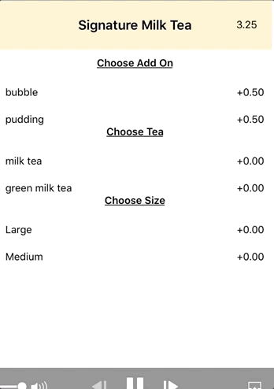

# Menu

## Preview

## Tool used
* React native
* expo
* lodash

## Hightlights
* Clean UI
* API Fetch
* Item quantity responsive to min/max requirement
* Enable alert for submit order pre-check

## Set up instruction
* Download this repo
* CLI:
  * npm install --install node modules
  * exp start

## NextSteps
  * Smooth render quantity circle show/hide
